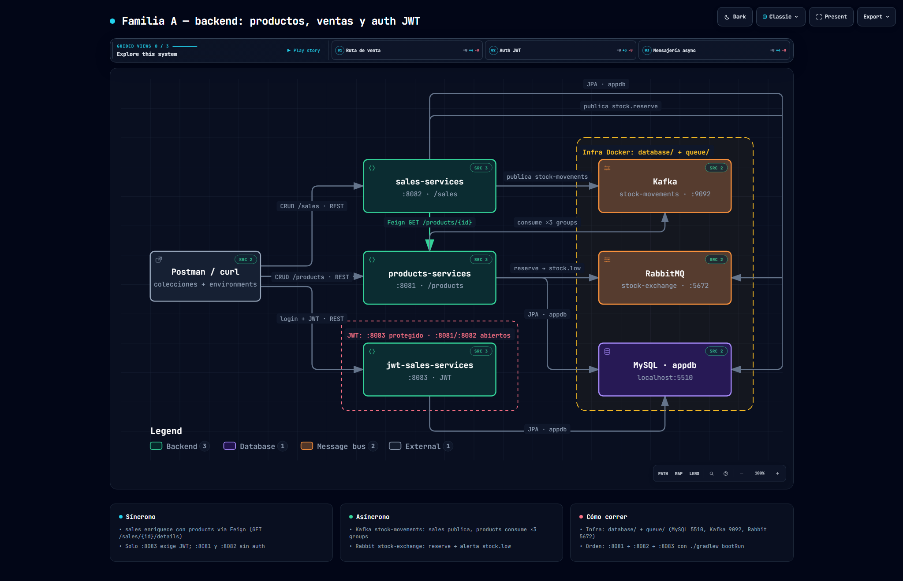
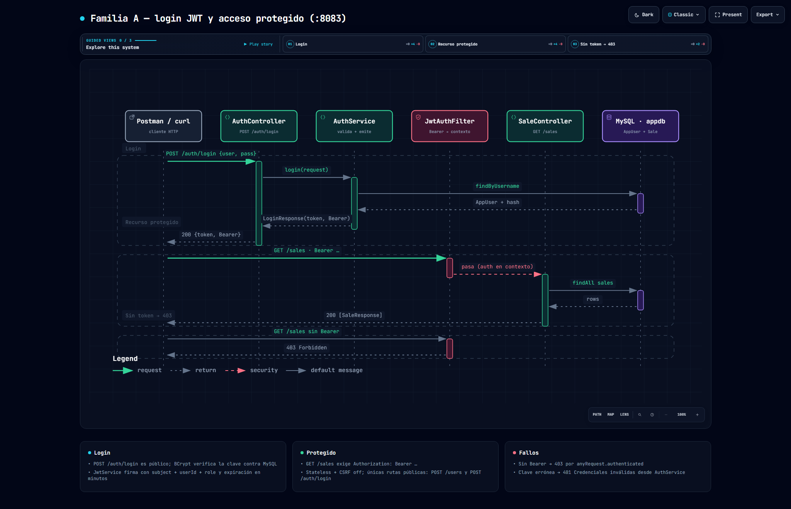
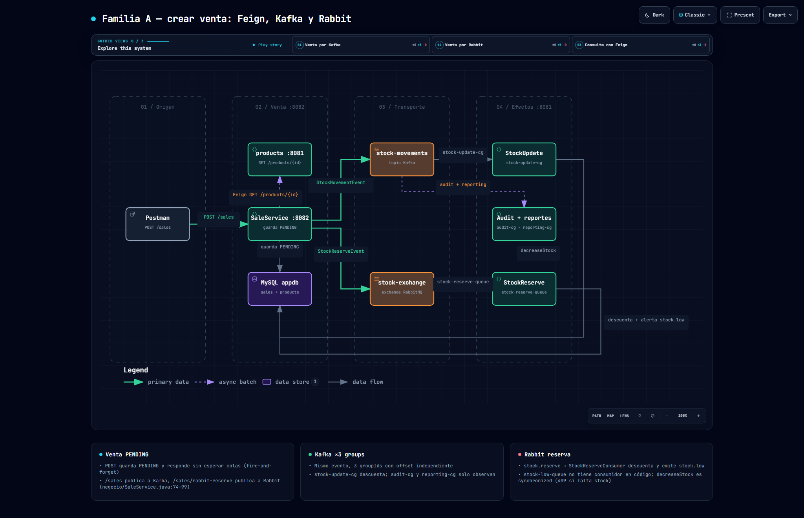

# DESARROLLO DE APLICACIONES WEB II — 04697

Monorepo del curso **DAW II**. El profesor condensó aquí **todas las clases, demos y exámenes**: cada carpeta es una familia independiente que corresponde a un bloque de clases. **No se levanta todo junto: se trabaja una familia a la vez.**

Mapa detallado en `.planning/codebase/` (`ARCHITECTURE.md`, `STACK.md`, `STRUCTURE.md`, `INTEGRATIONS.md`).

## Familias ↔ clases

| Familia | Carpeta | Bloque de clases | Qué enseña | Detalle |
|---|---|---|---|---|
| A | `backend/` | CRUD + JWT + mensajería base | REST/JPA/MySQL, auth JWT, Feign, Kafka + Rabbit | [ver README](backend/README.md) |
| B | `spring_cloud/` | Spring Cloud | Eureka, Gateway, `RestTemplate @LoadBalanced` (sin DB) | [ver README](spring_cloud/README.md) |
| C | `practica-examen/` | Práctica / examen | Pedidos ↔ notificaciones: doble Feign, cancelaciones Kafka, correos Rabbit | [ver README](practica-examen/README.md) |
| D | `resiliencia-demo/` | Resiliencia + K8s | Feign + CircuitBreaker + fallback, Actuator, despliegue minikube/ArgoCD | [ver README](resiliencia-demo/README.md) |
| Front | `frontend/hospital_web/` | Frontend (paralelo) | Plantilla Angular "Cliniva" con auth simulada, sin backend real | — |

## Regla de oro: una familia a la vez

Hay **colisiones de puertos**: 8081 y 8082 (A ↔ C), 8083 (A ↔ B), 8090 (Kafka-UI ↔ D). Apaga una familia antes de levantar otra.

## Infra con Docker (solo A y C)

Docker solo levanta la infraestructura. Los micros se corren con `bootRun`:

```bash
cd database && docker compose up -d                                  # MySQL 5510 + phpMyAdmin 3410
cd ../queue && docker compose -f docker-compose-kafka.yml up -d      # Kafka 9092 + UI 8090
cd ../queue && docker compose -f docker-compose-rabbitmq.yml up -d   # Rabbit 5672 + consola 15672
```

B y D no necesitan Docker en local. D trae `Dockerfile` + `k8s/` solo para la demo de despliegue.

## Puertos

| 8081 | 8082 | 8083 | 8761/8762 | 8300/8100 | 8090/8091 | 5510 | 9092/5672 |
|---|---|---|---|---|---|---|---|
| products / notif. | sales / pedidos | jwt / notif. stub | Eureka / Gateway | cuentas / recargas | pedidos / inventario | MySQL | Kafka / Rabbit |

## Postman (una colección por familia)

| Familia | Colección |
|---|---|
| A | `postman/Cibertec-JWT-Sales...` + `Cibertec-Microservices-Flows...` (+ 2 envs) |
| B | `spring_cloud/postman/sistema-fintech-...` |
| C | `practica-examen/ms-pedidos/postman/` + `ms-notificaciones/postman/` |
| D | `resiliencia-demo/postman/resiliencia-...` |

## Protocolos

Postman siempre es **HTTP/REST**. Entre servicios todo es **TCP**: HTTP (Feign/RestTemplate/gateway), Kafka binario (`:9092`), Rabbit AMQP (`:5672`), MySQL (`:5510`). **Nada UDP.**

## Diagramas (familia A)

En `docs/diagramas/`. Los PNG dark en alta resolución se ven directo aquí; los HTML son interactivos (descargar y abrir en el navegador, GitHub no los previsualiza).

| Diagrama | PNG (ver aquí) | Interactivo |
|---|---|---|
| Arquitectura familia A | [ver PNG](docs/diagramas/familia-a-arquitectura.visual-check.2048x1320.dark.png) | [abrir HTML](docs/diagramas/familia-a-arquitectura.html) |
| Login JWT | [ver PNG](docs/diagramas/familia-a-login-jwt.visual-check.2048x1320.dark.png) | [abrir HTML](docs/diagramas/familia-a-login-jwt.html) |
| Crear venta | [ver PNG](docs/diagramas/familia-a-crear-venta.visual-check.2048x1320.dark.png) | [abrir HTML](docs/diagramas/familia-a-crear-venta.html) |





## Requisitos

JDK 17 · Docker + Compose · Node 24 + npm · Postman. Cada servicio Gradle trae su `gradlew`; 4 módulos traen `mvnw`.
